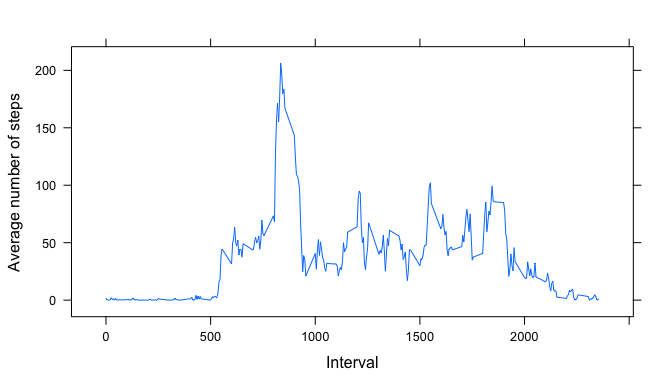
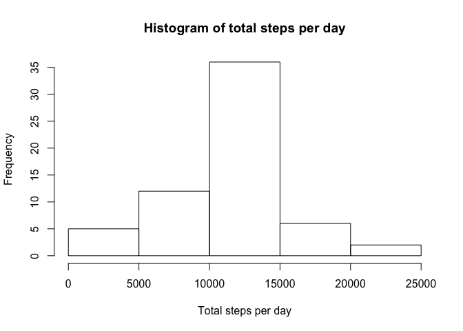
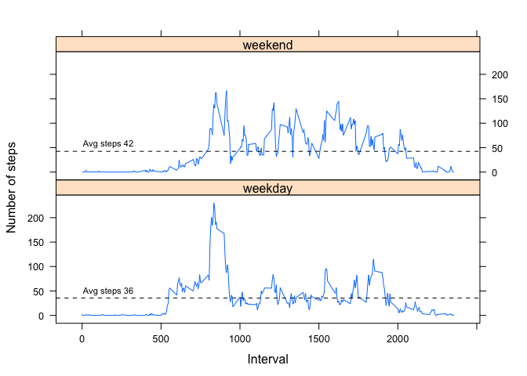

# Reproducible Research: Peer Assessment 1

It is now possible to collect a large amount of data about personal movement 
using activity monitoring devices such as a 
[Fitbit](http://www.fitbit.com/),
[Nike Fuelband](http://www.nike.com/us/en_us/c/nikeplus-fuelband), or 
[Jawbone Up](https://jawbone.com/up). 
These type of devices are part of the "quantified self" movement - a group 
of enthusiasts who take measurements about themselves regularly to improve 
their health, to find patterns in their behavior, or because they are tech 
geeks. But these data remain under-utilized both because the raw data are hard 
to obtain and there is a lack of statistical methods and software for 
processing and interpreting the data.

This assignment makes use of data from a personal activity monitoring device. 
This device collects data at 5 minute intervals through out the day. The data 
consists of two months of data from an anonymous individual collected during 
the months of October and November, 2012 and include the number of steps taken 
in 5 minute intervals each day.

## Loading and preprocessing the data
First the necessary libraries are loaded. As there is a warning message, that 
a function is hided, message is set to FALSE for this code block.

```r
library(lubridate)
library(plyr)
library(lattice)
```

For the plots the base and lattice plotting systems are used.  
In order to keep the scripts language neutrale the weekdays function was not 
used. Instead the wday function of the lubridate package is used.  
In addition the plyr package is used for computations.

For this script the Activity monitoring data must be located in the data 
directory beneath the current workspace directory. The original dataset can 
be loaded here:
[Activity monitoring data](https://d396qusza40orc.cloudfront.net/repdata%2Fdata%2Factivity.zip) [52K]

```r
activity.data <- read.csv("./data/activity.csv")
```

The dataset are consists of three variables:

- steps: Number of steps taking in a 5-minute interval (missing values are coded as NA)
- date: The date on which the measurement was taken in YYYY-MM-DD format
- interval: Identifier for the 5-minute interval in which measurement was taken

At first the total steps per day and the average steps per interval are calculated.
Therefor the ddply function of the plyr package is used.

```r
# total steps per date
steps <- ddply(activity.data, .(date), summarize, total = sum(steps))
# average steps per interval
steps.interval <- ddply(activity.data, .(interval), summarize, 
                        avg = mean(steps, na.rm = TRUE))
```

## What is mean total number of steps taken per day?

1. Make a histogram of the total number of steps taken each day

```r
hist(steps$total, main = "Histogram of total steps per day", 
     xlab="Total steps per day")
```

 

Most of the days about 10.000 and 15.000 steps are taken a dayx.

2. Calculate and report the mean and median total number of steps taken per day

```r
steps.mean <- as.integer(round(mean(steps$total, na.rm = TRUE)))
steps.median <- median(steps$total, na.rm = TRUE)
```

The mean count of steps a day is **10766** while the median count of 
steps a day is **10765**. There is only a differenc of one step 
between the mean and the median.

## What is the average daily activity pattern?

1. Make a time series plot (i.e. type = "l") of the 5-minute interval (x-axis)
and the average number of steps taken, averaged across all days (y-axis)

```r
xyplot(avg ~ interval, data = steps.interval, type = "l", xlab = "Interval", 
       ylab = "Average number of steps")
```

 
In the first hours of a day, there is more or less no acitivity. One probable 
reason may be that the individual was sleeping in these intervals. There is 
always a high acivity during the interval of 800 and 900 which may be an
indivator for walking to work or early-morning exercise.

2. Which 5-minute interval, on average across all the days in the dataset,
contains the maximum number of steps?

```r
max.interval <- steps.interval[which.max( steps.interval$avg ), ]$interval
```

The 5-minute with the maximum number of steps is **835**.

## Imputing missing values

1. Calculate and report the total number of missing values in the dataset
(i.e. the total number of rows with NAs)

```r
total.na <- sum(is.na(activity.data$steps))
total.na.perc <- round(100 / nrow(activity.data) * total.na)
```

The total number of missing values in this dataset is **2304** which 
is about **13** % of all values in the dataset. As this is a 
relativly high amount of missing values. A stategie is evolved for filling in 
all of the missing values with a good aproximation.

2. Devise a strategy for filling in all of the missing values in the dataset. 
The strategy does not need to be sophisticated. For example, you could use 
the mean/median for that day, or the mean for that 5-minute interval, etc.

The stategy used fills in the missing values with the average value of the 
interval. Therefor a function is created, which check if the steps are missing
for a single row. If this is the case a lookup of the average value of this 
interval is performed, otherwise the original value is taken.


```r
fill.strategy <- function(x) {
    if (is.na(x[1])) {
        # detect the row, containing the average for this interval
        row <- which(steps.interval$interval == as.integer(x[3]))
        # the result is rounded, as there are no half steps
        rounded <- round(steps.interval[row, 2])
        as.integer(rounded)
    } else {
        # not NA so the original value is returned
        x[1]
    }
}
```

This function can now be used in the apply function of r.

3. Create a new dataset that is equal to the 
original dataset but with the missing data filled in.


```r
# copy dataset to adf (activity data filled)
adf <- activity.data
# fill in the missing values from the previous strategy
adf$steps <- as.integer(apply(adf, 1, fill.strategy))
```

4. Make a histogram of the total number of steps taken each day and Calculate 
and report the mean and median total number of steps taken per day. Do 
these values differ from the estimates from the first part of the assignment? 
What is the impact of imputing missing data on the estimates of the total 
daily number of steps?


```r
adf.steps <- ddply(adf, .(date), summarize, total = sum(steps))
adf.mean <- as.integer(round(mean(adf.steps$total, na.rm = TRUE)))
adf.median <- median(adf.steps$total, na.rm = TRUE)

hist(adf.steps$total, main = "Histogram of total steps per day", 
     xlab="total steps per day")
```

 

The mean is 10766 and the median is 10762. Using mean of each
interval fo fill the missing values, there is no significant difference to the
original data set containing the missing values. The rounded values of mean

## Are there differences in activity patterns between weekdays and weekends?

1. Create a new factor variable in the dataset with two levels - "weekday" 
and "weekend" indicating whether a given date is a weekday or weekend day.

```r
adf$dow <- ifelse(wday(adf$date) %in% c(1, 7), "weekend", "weekday")
adf$dow <- factor(adf$dow)
```

2. Make a panel plot containing a time series plot (i.e. type = "l") of the 
5-minute interval (x-axis) and the average number of steps taken, averaged 
across all weekday days or weekend days (y-axis). The plot should look 
something like the following, which was creating using simulated data:


```r
aa <- ddply(adf, .(dow, interval), summarize, avg = mean(steps, na.rm = TRUE))
xyplot(aa$avg ~ aa$interval | aa$dow, layout = c(1, 2), type = "l", 
       xlab = "Interval", ylab = "Number of steps",
       panel = function(x, y, ...) {
    panel.xyplot(x, y, ...)  ## First call the default panel function for 'xyplot'
    panel.abline(h = mean(y), lty = 2)  ## Add a horizontal line at the mean
    panel.text(lab = paste("Avg steps", round(mean(y))), x = 5, y = mean(y), 
               adj = c(0, -0.8), cex = 0.7) ## Add values of mean to the line
})
```

 
